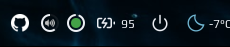
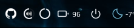

# Battery Widget

Charging:  


Not charging:  


# Installation

```lua
local noobie_battery = require("noobie")
-- ... 
noobie_battery {
    path = os.getenv("HOME") .. '/.config/awesome/noobie-plugins/battery/battery_status.sh',
    refresh_rate = 5
}
```