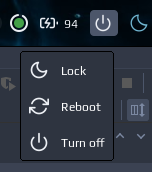

# Logout widget



# Installation

```lua
local noobie_logout = require("noobie")

noobie_logout {
    path = 'cat ' .. os.getenv("HOME") .. '/.config/awesome/noobie-plugins/logout/logout_widget.json'
}
```
