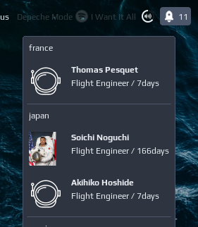

# People in Space

A widget showing how many people are currently in space, plus some info about astronauts:



```lua
local noobie_people_in_space = require("noobie")

noobie_people_in_space {
    path = "/home/pmakhov/.config/awesome/noobie-plugins/people-in-space/people-in-space.py"
}
```