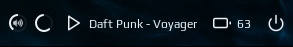
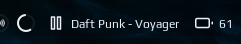

# Spotify





Controls:
 - left click - toggle play
 - scroll up - next song
 - scroll down - previous song

# Installation

```lua
local noobie_spotify = require("noobie")

noobie_spotify {
    path = os.getenv("HOME") .. '/.config/awesome/noobie-plugins/spotify/spotify.sh',
    refresh_rate = 1
},
```