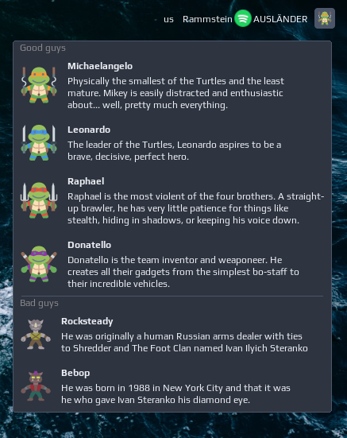

# TMNT widget

A static simple widget with large icons, headers, separator and subtitle:



## Installation

```lua
local noobie_tmnt = require("noobie")

noobie_tmnt{ 
    path = 'cat ' .. os.getenv("HOME") .. '/.config/awesome/noobie-plugins/tmnt/tmnt.json' 
},
```


https://www.flaticon.com/packs/pokemon-go

<div>Icons made by <a href="https://www.flaticon.com/authors/surang" title="surang">surang</a> from <a href="https://www.flaticon.com/" title="Flaticon">www.flaticon.com</a></div>
